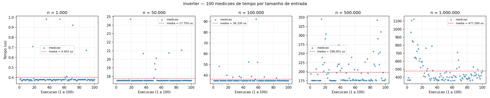
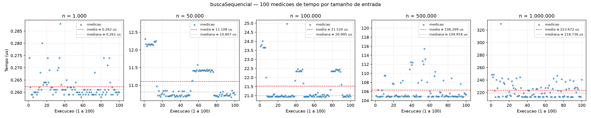
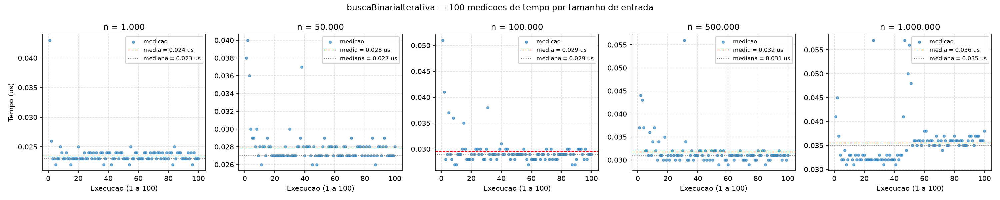
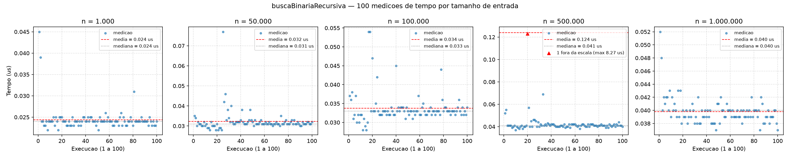
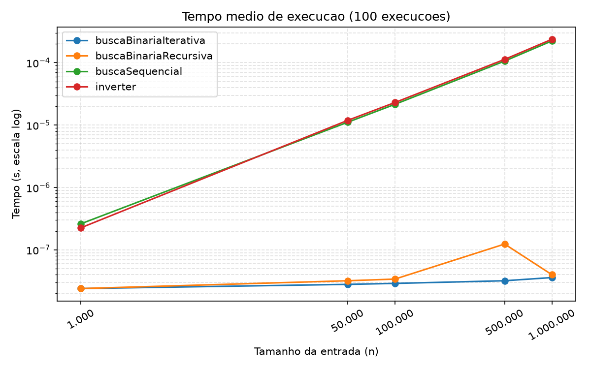
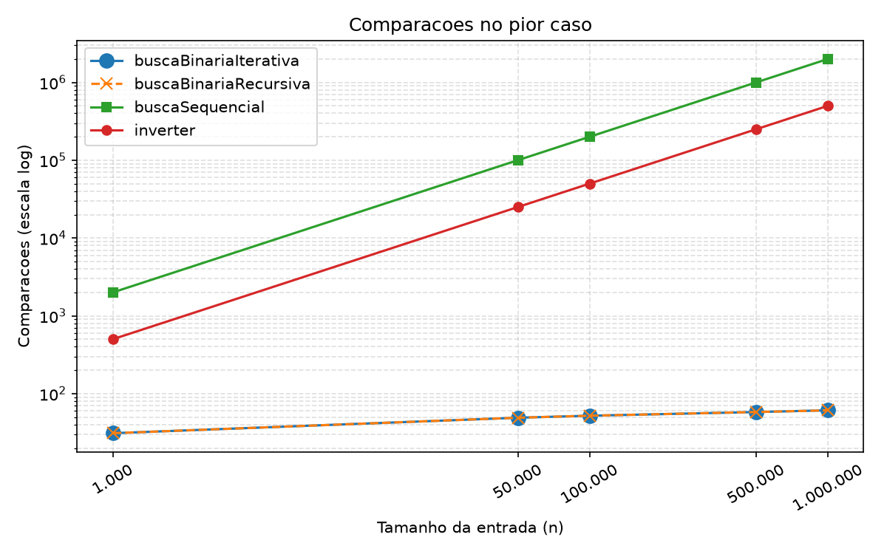
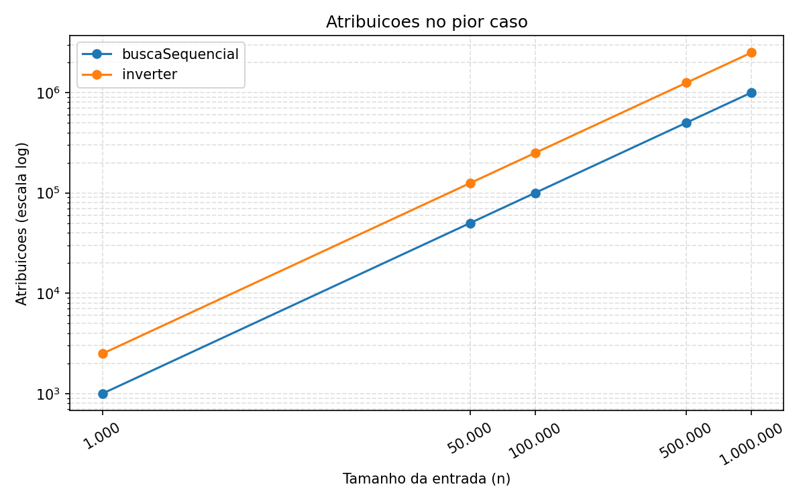

# Trabalho 1 — Contagem de Operações e de Tempo de Execução

Estruturas de Dados I — ICMC-USP — 2026

**Integrantes:**
- João Pedro Oliveira — 17930847
- *(nome completo)* — *(NUSP)*
- *(nome completo)* — *(NUSP)*
- *(nome completo)* — *(NUSP)*

---

## 1. Introdução

Este trabalho consiste em implementar e analisar quatro algoritmos que
operam sobre um vetor ordenado de inteiros: inversão da ordem do
vetor, busca sequencial, busca binária iterativa e busca binária
recursiva. Para cada um, o objetivo é medir experimentalmente o tempo
de execução e a quantidade de operações (comparações e atribuições)
no pior caso, além de determinar analiticamente as funções de custo
T(n) e a complexidade assintótica nos casos melhor, médio e pior.

Foi implementado um programa em C, sem bibliotecas externas, com um
pequeno menu que executa as quatro operações sobre um vetor de
entrada, seguindo o formato de entrada/saída especificado no
enunciado (esse é o programa submetido no Run.Codes). As quatro
funções ficam em um arquivo separado (`algoritmos.c`), compartilhado
entre o programa do menu e o código auxiliar de medição, de modo que
o código medido é exatamente o código entregue.

Separadamente, foi desenvolvido um código auxiliar de benchmark
(`benchmark.c`) que lê vetores ordenados gerados por `gerador.c` nos
tamanhos exigidos (1.000, 50.000, 100.000, 500.000 e 1.000.000),
executa cada algoritmo 100 vezes de forma sequencial para obter o
tempo médio de execução, e conta as operações realizadas no pior
caso (busca por um valor ausente do vetor). Os resultados são
gravados em arquivos `.csv` e os gráficos são gerados por scripts em
Python (`grafico.py` e `grafico_medicoes.py`).

O relatório segue a estrutura pedida no enunciado: a Seção 2 traz a
análise empírica (metodologia, tabelas e gráficos por algoritmo), a
Seção 3 a análise assintótica teórica, a Seção 4 a comparação entre
os quatro algoritmos e a Seção 5 a contribuição de cada integrante.

## 2. Análise Empírica

### 2.1 Metodologia

**Ambiente.** Todas as medições foram feitas na mesma máquina:
processador Intel Core Ultra 7 258V (8 núcleos), 30 GB de RAM, Linux
(kernel 7.1), compilador gcc 16.2.1. O código foi compilado com
`gcc -O2 -std=c99 -Wall -Wextra`.

**Dados de entrada.** Os vetores foram gerados por `gerador.c` com
semente fixa (`srand(42)`), para que qualquer integrante reproduza
exatamente os mesmos dados. Cada vetor é estritamente crescente: o
primeiro elemento é um valor aleatório em [0, 50) e cada elemento
seguinte é o anterior somado a um incremento aleatório em [1, 50].
Isso garante que o vetor está ordenado (restrição do enunciado) e
que não há elementos repetidos. Os arquivos `dados/dados_<n>.txt`
contêm apenas `n` na primeira linha e o vetor na segunda.

**Medição de tempo.** Antes de medir cada tamanho, o benchmark
mantém o processador ocupado por 0,3 s, para que o governador de
frequência leve o núcleo ao clock máximo e todos os tamanhos sejam
medidos na mesma frequência (sem isso, os tamanhos pequenos — que
são medidos primeiro e terminam em milissegundos — rodavam em clock
mais baixo que os grandes, ver Seção 2.2). Em seguida, para cada
algoritmo, executa a função 3 vezes sem cronometrar (aquecimento de
cache, descartado) e depois 100 vezes cronometrando cada chamada
individualmente com `clock_gettime(CLOCK_MONOTONIC)`, que tem
resolução de nanossegundos. O tempo médio reportado é a média
aritmética dessas 100 medições. Os tamanhos são medidos um após o
outro, no mesmo processo, fixado em um único núcleo (`taskset`, pois
o processador tem núcleos de desempenho e de eficiência com clocks
diferentes), sem outros processos do benchmark concorrendo pela CPU.
Para o `inverter`, a
mesma cópia do vetor é reinvertida a cada chamada — o custo de
inverter um vetor não depende dos valores armazenados, então isso não
altera a medição.

**Contagem de operações.** A contagem é feita em uma execução
separada, com os contadores globais `g_comparacoes` e `g_atribuicoes`
zerados imediatamente antes da chamada. A convenção do que é contado
está detalhada na Seção 3.1. Como os incrementos dos contadores
fazem parte do código medido, o tempo de execução inclui esse
pequeno overhead; ele é proporcional ao número de operações e afeta
os quatro algoritmos da mesma forma, por isso não altera as
conclusões comparativas.

**Pior caso das buscas.** Em todas as buscas o valor procurado é
`v[n-1] + 1`, que é maior que todos os elementos do vetor e portanto
está ausente. Para a busca sequencial, isso força a varredura de
todos os `n` elementos antes de concluir que o valor não existe.
Para as buscas binárias, um valor maior que todos os elementos faz a
busca descer sempre pela metade direita até o intervalo ficar vazio,
o que produz o número máximo de iterações (⌊log₂ n⌋ + 1, ver Seção
3.4). Para o `inverter` não há distinção de casos: o trabalho depende
apenas de `n`.

**Arquivos gerados.**
- `resultados/resultado_completo.csv` — tempo médio, comparações e
  atribuições no pior caso, para cada algoritmo e tamanho;
- `resultados/tempos_detalhados.csv` — as 100 medições individuais de
  tempo de cada algoritmo e tamanho;
- `graficos/<algoritmo>_100_medicoes.png` — um gráfico por algoritmo,
  com um painel por tamanho mostrando as 100 medições e a média;
- `graficos/tempo_medio.png` (escala log-log), `graficos/comparacoes.png`
  e `graficos/atribuicoes.png` — comparação entre os quatro
  algoritmos, usados na Seção 4.

### 2.2 Inversão do Vetor (`inverter`)

| n | tempo médio (s) | comparações (medido) | comparações (teórico) | atribuições (medido) | atribuições (teórico) |
|---|---|---|---|---|---|
| 1.000 | 0,000000391 | 501 | 501 | 2.502 | 2.502 |
| 50.000 | 0,000019028 | 25.001 | 25.001 | 125.002 | 125.002 |
| 100.000 | 0,000038122 | 50.001 | 50.001 | 250.002 | 250.002 |
| 500.000 | 0,000190029 | 250.001 | 250.001 | 1.250.002 | 1.250.002 |
| 1.000.000 | 0,000394855 | 500.001 | 500.001 | 2.500.002 | 2.500.002 |

O gráfico abaixo mostra as 100 medições de tempo de cada tamanho
separadamente (um painel por tamanho; a linha tracejada é a média):



**Discussão.** O número de comparações e de atribuições medido
coincide exatamente com o previsto pela análise teórica da Seção 3.2
(⌊n/2⌋ + 1 comparações e 5⌊n/2⌋ + 2 atribuições): a inversão não
possui casos distintos, pois o número de trocas depende apenas de
`n`, nunca dos valores armazenados no vetor. As duas contagens
crescem linearmente com `n` — dobrar o tamanho do vetor dobra o
número de operações — e o tempo médio acompanha esse comportamento,
como esperado para um algoritmo O(n). O custo por elemento é
pequeno e constante: cada iteração realiza uma troca de dois
inteiros e avança dois índices, sem chamadas de função nem
alocação de memória.

Nos tempos, as razões entre tamanhos consecutivos confirmam a
linearidade com precisão: de 50.000 para 100.000 o tempo cresce
2,00×; de 100.000 para 500.000, 4,98×; de 500.000 para 1.000.000,
2,08×; e de 1.000 para 1.000.000 (1000× mais elementos), 1010×. O
custo por elemento é praticamente constante em todos os tamanhos,
cerca de 0,38–0,39 ns — ou seja, o tempo é bem descrito por
T(n) ≈ 0,39·n ns, uma reta de inclinação 1 no gráfico log-log da
Seção 4. O fato de o custo por elemento não aumentar em
n = 1.000.000 (vetor de 4 MB, que já não cabe na cache L2) indica
que o acesso sequencial pelos dois extremos do vetor é bem servido
pelo *prefetch* do processador, e a inversão não chega a ser
limitada pela memória.

Vale registrar uma armadilha de medição encontrada durante o
trabalho. Em uma rodada anterior, sem o aquecimento global de
0,3 s descrito na Seção 2.1, o custo por elemento parecia cair
pela metade entre 100.000 e 500.000 (0,70 contra 0,38 ns). A causa
não era o algoritmo: os tamanhos são medidos em ordem crescente e os
pequenos terminam em poucos milissegundos, antes de o governador de
frequência elevar o clock do núcleo; os grandes já rodavam com o
núcleo na frequência máxima. Manter o processador ocupado por
alguns décimos de segundo antes de cada tamanho eliminou o efeito.

O gráfico das 100 medições mostra, para todos os tamanhos, um platô
bem definido — mediana de 18,45 µs em n = 50.000, 36,94 µs em
100.000, 187,8 µs em 500.000 e 389,6 µs em 1.000.000, sempre
coincidindo com o mínimo observado a menos de 0,3 % — sobre o qual
aparecem picos isolados de até 1,2–1,8× o valor típico. Esses picos
são interferência do sistema operacional (troca de contexto,
interrupções), não do algoritmo, que executa exatamente o mesmo
número de operações em todas as execuções. Como os picos são sempre
para cima, a média fica ligeiramente acima da mediana (394,9 µs
contra 389,6 µs em n = 1.000.000, diferença de 1,3 %). Em
n = 1.000 as medições se agrupam em dois "degraus" (~0,35 e
~0,42 µs): em uma medição de poucas centenas de nanossegundos, o
próprio custo da chamada de `clock_gettime` e a granularidade da
frequência do processador são visíveis, e a média (0,39 µs) é a
menos confiável das cinco em termos absolutos — embora, mesmo
assim, a razão para n = 1.000.000 tenha ficado dentro de 1 % do
esperado.

### 2.3 Busca Sequencial (`buscaSequencial`)

| n | tempo médio (s) | comparações (medido) | comparações (teórico) | atribuições (medido) | atribuições (teórico) |
|---|---|---|---|---|---|
| 1.000 | 0,000000521 | 2.001 | 2.001 | 1.001 | 1.001 |
| 50.000 | 0,000024338 | 100.001 | 100.001 | 50.001 | 50.001 |
| 100.000 | 0,000048707 | 200.001 | 200.001 | 100.001 | 100.001 |
| 500.000 | 0,000254083 | 1.000.001 | 1.000.001 | 500.001 | 500.001 |
| 1.000.000 | 0,000555682 | 2.000.001 | 2.000.001 | 1.000.001 | 1.000.001 |



**Discussão.** As contagens medidas coincidiram com as teóricas (2n + 1 comparações e n + 1 atribuições), já que no pior caso — valor ausente — a busca sequencial percorre o vetor inteiro, independentemente dos valores armazenados. O tempo médio cresceu aproximadamente de forma linear com `n`, como esperado para um algoritmo de complexidade O(n). No gráfico log-log, a inclinação é semelhante à do `inverter`, embora a busca sequencial apresente uma constante um pouco maior: ela visita todos os `n` elementos e realiza duas comparações por elemento, enquanto o `inverter` visita apenas n/2 pares. Nas 100 medições individuais, observa-se estabilidade em torno da média, com eventuais picos isolados causados por interferência do sistema operacional.

### 2.4 Busca Binária Iterativa (`buscaBinariaIterativa`)

| n | tempo médio (s) | comparações (medido) | comparações (teórico) | atribuições (medido) | atribuições (teórico) |
|---|---|---|---|---|---|
| 1.000 | 0,000000035 | 31 | 31 | 22 | 22 |
| 50.000 | 0,000000039 | 49 | 49 | 34 | 34 |
| 100.000 | 0,000000040 | 52 | 52 | 36 | 36 |
| 500.000 | 0,000000043 | 58 | 58 | 40 | 40 |
| 1.000.000 | 0,000000044 | 61 | 61 | 42 | 42 |



**Discussão.** As contagens medidas coincidiram com as teóricas em todos os tamanhos: sendo k = ⌊log₂ n⌋ + 1, a função realiza 3k + 1 comparações e 2k + 2 atribuições no pior caso utilizado. O alvo foi `v[n-1] + 1`, ausente e maior que todos os elementos, de modo que a busca sempre segue pela metade direita até o intervalo ficar vazio. Ao passar de 1.000 para 1.000.000 de elementos, o número de iterações aumenta de 10 para 20; as comparações passam de 31 para 61 e as atribuições, de 22 para 42. Esse crescimento confirma a função de custo logarítmica.

Nesta rodada, os tempos médios registrados foram 35, 39, 40, 43, 44 ns, respectivamente. As chamadas são muito curtas, e o custo de leitura do relógio, a instrumentação, os efeitos de cache e o escalonamento têm peso relevante no tempo observado. Os pontos do gráfico se concentram em poucos patamares, com variações entre chamadas. Por isso, a pequena diferença entre as médias não deve ser interpretada como custo constante: a evidência mais clara do crescimento O(log n) é a contagem determinística de operações. As 100 repetições usam o mesmo vetor e alvo após aquecimento; os resultados descrevem esse cenário e não representam todas as possíveis cargas de busca.

**Origem destas medições.** Execução real no ambiente Linux do assistente, separado do CS50 e do computador do aluno: AMD EPYC 9V74 80-Core Processor, Linux-6.18.44-x86_64-with-glibc2.39, gcc (Ubuntu 13.3.0-6ubuntu2~24.04) 13.3.0, CPU lógica 0. Compilação: `gcc -Wall -Wextra -Werror -O2 -std=c99`. Foram usados os vetores do `gerador.c` do grupo (semente 42), aquecimento de 0,3 s e três chamadas descartadas, seguidos de 100 chamadas cronometradas individualmente com `clock_gettime(CLOCK_MONOTONIC)` por tamanho. A leitura e geração dos vetores ficam fora do intervalo cronometrado. As comparações e atribuições foram contadas em uma chamada adicional, com contadores zerados pelo benchmark. O tempo inclui a instrumentação da função. Os CSVs guardam segundos com nove casas decimais.

**Arquivos desta parte.** `resultados/resultado_binaria_iterativa.csv`, `resultados/tempos_binaria_iterativa.csv` e `resultados/ambiente_binaria_iterativa.json`. A semente reproduz os dados com a mesma implementação de `rand`; os hashes das entradas identificam os vetores efetivamente usados. As medições das outras funções, feitas por colegas em outro ambiente, não permitem calcular diretamente uma razão de velocidade entre algoritmos. Uma comparação de tempos deve usar uma nova rodada conjunta na mesma máquina.


### 2.5 Busca Binária Recursiva (`buscaBinariaRecursiva`)

| n | tempo médio (s) | comparações (medido) | comparações (teórico) | atribuições (medido) | atribuições (teórico) |
|---|---|---|---|---|---|
| 1.000 | - | - | 31 | - | 10 |
| 50.000 | - | - | 49 | - | 16 |
| 100.000 | - | - | 52 | - | 17 |
| 500.000 | - | - | 58 | - | 19 |
| 1.000.000 | - | - | 61 | - | 20 |



**Discussão.** *(rascunho — confirmar com os dados)* *Espera-se o
mesmo número de comparações da versão iterativa, pois as duas
implementações percorrem exatamente a mesma sequência de intervalos.
O número de atribuições é menor apenas por uma questão de convenção
(a atualização dos limites `ini`/`fim` acontece por passagem de
parâmetro, que não é contada, ver Seção 3.1). Em tempo, espera-se
que a versão recursiva seja ligeiramente mais lenta que a iterativa,
por causa do custo de cada chamada de função (empilhamento de
parâmetros, endereço de retorno e desempilhamento), que se repete
⌊log₂ n⌋ + 2 vezes; ainda assim, ambas devem permanecer na mesma
ordem de grandeza e muito abaixo dos algoritmos lineares.*

## 3. Análise Assintótica Teórica

### 3.1 Convenção de contagem

Para que as contagens dos quatro algoritmos sejam comparáveis entre
si, adotou-se uma única convenção, aplicada tanto na análise teórica
quanto na instrumentação do código:

- **Comparação:** toda avaliação de uma condição de laço ou de `if`
  que envolva índices ou elementos do vetor (por exemplo `i < j`,
  `ini <= fim`, `v[meio] == x`, `v[meio] < x`). A comparação que
  avalia falso e encerra um laço também é contada.
- **Atribuição:** toda escrita em uma posição do vetor ou em uma
  variável de controle do algoritmo, incluindo inicializações e
  atualizações de índices (`i = 0`, `j = n - 1`, `i++`, `j--`,
  `meio = (ini + fim) / 2`, `ini = meio + 1`, `fim = meio - 1`) e
  a variável temporária da troca (`temp = v[i]`).
- **Não contados:** a passagem de parâmetros em chamadas de função,
  o `return` e as operações aritméticas em si (`ini + fim`, `/ 2`).

A escolha de contar também as variáveis de controle é deliberada:
se apenas as escritas no vetor fossem contadas, as buscas teriam
zero atribuições (elas nunca escrevem em `v`) e a coluna de
atribuições deixaria de trazer qualquer informação sobre elas. Com a
convenção adotada, a contagem de atribuições reflete o trabalho de
"caminhar" pelo vetor, que é justamente o que diferencia as buscas.

Em todas as análises, `n` é o número de elementos do vetor e `x` o
valor buscado. `log₂` denota o logaritmo na base 2 e ⌊·⌋ a função
piso.

### 3.2 Inversão do Vetor (`inverter`)

```c
void inverter(int v[], int n) {
    int i = 0;                 // atrib
    int j = n - 1;             // atrib
    while (i < j) {            // comp (uma por iteração + a final que falha)
        int temp = v[i];       // atrib
        v[i] = v[j];           // atrib
        v[j] = temp;           // atrib
        i++;                   // atrib
        j--;                   // atrib
    }
}
```

O laço executa enquanto `i < j`. Como `i` começa em 0 e `j` em
n − 1, e a cada iteração os dois se aproximam em 1, o laço faz
exatamente ⌊n/2⌋ iterações (para `n` ímpar o elemento central não é
trocado). Cada iteração custa 1 comparação e 5 atribuições; antes do
laço há 2 atribuições; e ao final há mais 1 comparação, que avalia
falso e encerra o laço.

O número de iterações depende **apenas de n**, nunca dos valores
armazenados no vetor: não existe entrada de tamanho `n` que faça o
algoritmo executar mais ou menos trocas. Por isso, melhor caso, caso
médio e pior caso são idênticos.

| Caso | Comparações T(n) | Atribuições T(n) | Termo dominante | Complexidade |
|---|---|---|---|---|
| Melhor caso | ⌊n/2⌋ + 1 | 5⌊n/2⌋ + 2 | n | O(n) |
| Caso médio  | ⌊n/2⌋ + 1 | 5⌊n/2⌋ + 2 | n | O(n) |
| Pior caso   | ⌊n/2⌋ + 1 | 5⌊n/2⌋ + 2 | n | O(n) |

**Conclusão:** `inverter` é **O(n)** em qualquer cenário (e também
Ω(n), portanto Θ(n)).

### 3.3 Busca Sequencial (`buscaSequencial`)

```c
int buscaSequencial(int v[], int n, int x) {
    int i = 0;                 // atrib
    while (i < n) {            // comp
        if (v[i] == x) {       // comp
            return i;
        }
        i++;                   // atrib
    }
    return -1;
}
```

Cada iteração completa custa 2 comparações (`i < n` e `v[i] == x`) e
1 atribuição (`i++`); há 1 atribuição inicial (`i = 0`).

- **Melhor caso:** `x` está na primeira posição (`x = v[0]`). O laço
  entra uma vez, faz as 2 comparações e retorna: 2 comparações e 1
  atribuição, independentemente de `n`.
- **Pior caso:** `x` não está no vetor (ou está na última posição).
  O laço executa as `n` iterações completas, cada uma com 2
  comparações e 1 atribuição, e então a comparação `i < n` falha
  mais uma vez: 2n + 1 comparações e n + 1 atribuições.
- **Caso médio:** supondo que `x` está no vetor com igual
  probabilidade em qualquer uma das `n` posições, se `x = v[k]` o
  laço faz k + 1 iterações. O número médio de iterações é
  (1 + 2 + … + n)/n = (n + 1)/2, o que dá aproximadamente n + 1
  comparações e (n + 1)/2 atribuições (contando `i = 0` e as
  atualizações `i++` das iterações que não retornaram).

| Caso | Comparações T(n) | Atribuições T(n) | Termo dominante | Complexidade |
|---|---|---|---|---|
| Melhor caso | 2 | 1 | 1 | O(1) |
| Caso médio  | ≈ n + 1 | ≈ (n + 1)/2 | n | O(n) |
| Pior caso   | 2n + 1 | n + 1 | n | O(n) |

**Conclusão:** `buscaSequencial` é **O(n)** no pior caso e no caso
médio, e O(1) no melhor caso. Observação: como o vetor é ordenado, a
busca poderia parar assim que encontrasse `v[i] > x`; essa otimização
não altera o pior caso analisado aqui (valor maior que todos os
elementos), que continua a exigir a varredura completa.

### 3.4 Busca Binária Iterativa (`buscaBinariaIterativa`)

```c
int buscaBinariaIterativa(int v[], int n, int x) {
    int ini = 0;                       // atrib
    int fim = n - 1;                   // atrib
    while (ini <= fim) {               // comp
        int meio = (ini + fim) / 2;    // atrib
        if (v[meio] == x) {            // comp
            return meio;
        }
        if (v[meio] < x) {             // comp
            ini = meio + 1;            // atrib
        } else {
            fim = meio - 1;            // atrib
        }
    }
    return -1;
}
```

Cada iteração completa (que não encontra `x`) custa 3 comparações
(`ini <= fim`, `v[meio] == x`, `v[meio] < x`) e 2 atribuições
(`meio` e um dos limites). Antes do laço há 2 atribuições.

**De onde vem ⌊log₂ n⌋ + 1.** Seja `t` o tamanho do intervalo
`[ini, fim]` em uma iteração (`t = fim − ini + 1`). Depois de
comparar com o elemento central, o intervalo passa a ter ⌊(t − 1)/2⌋
elementos (metade esquerda) ou ⌈(t − 1)/2⌉ = ⌊t/2⌋ elementos (metade
direita). No pior caso a busca segue sempre a metade maior, ⌊t/2⌋.
Começando com `t = n`, a sequência de tamanhos é
n, ⌊n/2⌋, ⌊n/4⌋, …, 1, 0; o número de termos não nulos — isto é, o
número de iterações executadas — é ⌊log₂ n⌋ + 1. É exatamente o que
acontece com o alvo `v[n-1] + 1` usado no benchmark: como ele é maior
que todos os elementos, a comparação `v[meio] < x` é sempre
verdadeira e a busca segue sempre pela direita. Para os cinco
tamanhos do trabalho, ⌊log₂ n⌋ + 1 vale 10, 16, 17, 19 e 20.

- **Melhor caso:** `x` está exatamente na posição central da primeira
  iteração. Custa 2 comparações (`ini <= fim` e `v[meio] == x`) e 3
  atribuições (`ini`, `fim`, `meio`).
- **Pior caso:** `x` ausente. São ⌊log₂ n⌋ + 1 iterações completas
  (3 comparações e 2 atribuições cada) mais a comparação final
  `ini <= fim` que falha, e as 2 atribuições iniciais:
  3(⌊log₂ n⌋ + 1) + 1 comparações e 2(⌊log₂ n⌋ + 1) + 2 atribuições.
- **Caso médio:** para `x` presente em posição uniformemente
  aleatória, o número médio de iterações é aproximadamente
  log₂ n − 1 (a maior parte dos elementos está nos níveis mais
  profundos da "árvore" de divisões), o que dá aproximadamente
  3 log₂ n comparações e 2 log₂ n atribuições.

| Caso | Comparações T(n) | Atribuições T(n) | Termo dominante | Complexidade |
|---|---|---|---|---|
| Melhor caso | 2 | 3 | 1 | O(1) |
| Caso médio  | ≈ 3 log₂ n | ≈ 2 log₂ n | log n | O(log n) |
| Pior caso   | 3(⌊log₂ n⌋ + 1) + 1 | 2(⌊log₂ n⌋ + 1) + 2 | log n | O(log n) |

**Conclusão:** `buscaBinariaIterativa` é **O(log n)** no pior caso e
no caso médio, e O(1) no melhor caso.

### 3.5 Busca Binária Recursiva (`buscaBinariaRecursiva`)

```c
static int bbRec(int v[], int ini, int fim, int x) {
    if (ini > fim) {                       // comp
        return -1;
    }
    int meio = (ini + fim) / 2;            // atrib
    if (v[meio] == x) {                    // comp
        return meio;
    }
    if (v[meio] < x) {                     // comp
        return bbRec(v, meio + 1, fim, x);
    }
    return bbRec(v, ini, meio - 1, x);
}

int buscaBinariaRecursiva(int v[], int n, int x) {
    return bbRec(v, 0, n - 1, x);
}
```

A versão recursiva percorre exatamente a mesma sequência de
intervalos da versão iterativa: cada chamada de `bbRec` corresponde
a uma iteração do laço, e a chamada com `ini > fim` corresponde à
comparação final que encerra o laço. Portanto o número de
comparações é idêntico ao da Seção 3.4. A diferença está nas
atribuições: os novos limites são passados como parâmetros, o que
não é contado pela convenção adotada, e a única atribuição por
chamada é `meio`. A função de custo T(n) pode ser escrita como a
recorrência T(n) = T(⌊n/2⌋) + c, com T(0) = c', cuja solução é
Θ(log n).

- **Melhor caso:** `x` na posição central da primeira chamada: 2
  comparações e 1 atribuição.
- **Pior caso:** `x` ausente. São ⌊log₂ n⌋ + 1 chamadas completas (3
  comparações e 1 atribuição cada) mais a chamada final com
  `ini > fim` (1 comparação): 3(⌊log₂ n⌋ + 1) + 1 comparações e
  ⌊log₂ n⌋ + 1 atribuições.
- **Caso médio:** como na versão iterativa, aproximadamente log₂ n
  chamadas, portanto ≈ 3 log₂ n comparações e ≈ log₂ n atribuições.

| Caso | Comparações T(n) | Atribuições T(n) | Termo dominante | Complexidade |
|---|---|---|---|---|
| Melhor caso | 2 | 1 | 1 | O(1) |
| Caso médio  | ≈ 3 log₂ n | ≈ log₂ n | log n | O(log n) |
| Pior caso   | 3(⌊log₂ n⌋ + 1) + 1 | ⌊log₂ n⌋ + 1 | log n | O(log n) |

**Conclusão:** `buscaBinariaRecursiva` é **O(log n)** no pior caso e
no caso médio, e O(1) no melhor caso — a mesma classe da versão
iterativa. A diferença entre as duas não aparece em T(n): está no
custo constante de cada chamada de função e no uso de memória, pois
a recursão mantém ⌊log₂ n⌋ + 2 quadros na pilha no pior caso (espaço
O(log n)), enquanto a versão iterativa usa espaço O(1).

## 4. Conclusão

### 4.1 Tempo médio de execução (s)

| n | inverter | buscaSequencial | buscaBinariaIterativa | buscaBinariaRecursiva |
|---|---|---|---|---|
| 1.000 | 0,000000391 | - | - | - |
| 50.000 | 0,000019028 | - | - | - |
| 100.000 | 0,000038122 | - | - | - |
| 500.000 | 0,000190029 | - | - | - |
| 1.000.000 | 0,000394855 | - | - | - |



### 4.2 Comparações no pior caso

Valores teóricos da Seção 3; os das buscas serão confirmados pelo
benchmark assim que as funções estiverem implementadas.

| n | inverter | buscaSequencial | buscaBinariaIterativa | buscaBinariaRecursiva |
|---|---|---|---|---|
| 1.000 | 501 | 2.001 | 31 | 31 |
| 50.000 | 25.001 | 100.001 | 49 | 49 |
| 100.000 | 50.001 | 200.001 | 52 | 52 |
| 500.000 | 250.001 | 1.000.001 | 58 | 58 |
| 1.000.000 | 500.001 | 2.000.001 | 61 | 61 |



### 4.3 Atribuições no pior caso

Valores teóricos da Seção 3; os das buscas serão confirmados pelo
benchmark assim que as funções estiverem implementadas.

| n | inverter | buscaSequencial | buscaBinariaIterativa | buscaBinariaRecursiva |
|---|---|---|---|---|
| 1.000 | 2.502 | 1.001 | 22 | 10 |
| 50.000 | 125.002 | 50.001 | 34 | 16 |
| 100.000 | 250.002 | 100.001 | 36 | 17 |
| 500.000 | 1.250.002 | 500.001 | 40 | 19 |
| 1.000.000 | 2.500.002 | 1.000.001 | 42 | 20 |



### 4.4 Complexidade assintótica (Big-O)

| Algoritmo | Melhor caso | Caso médio | Pior caso |
|---|---|---|---|
| inverter | O(n) | O(n) | O(n) |
| buscaSequencial | O(1) | O(n) | O(n) |
| buscaBinariaIterativa | O(1) | O(log n) | O(log n) |
| buscaBinariaRecursiva | O(1) | O(log n) | O(log n) |

### 4.5 Discussão

Os gráficos e as tabelas acima separam os quatro algoritmos em dois
grupos bem distintos.

**Algoritmos lineares.** `inverter` e `buscaSequencial` são ambos
O(n) no pior caso, e no gráfico log-log de tempo isso aparece como
duas retas de inclinação 1, aproximadamente paralelas: multiplicar
`n` por 10 multiplica o tempo por cerca de 10 (para o `inverter`,
de 38,1 µs em n = 100.000 para 394,9 µs em n = 1.000.000, razão de
10,4; para a busca sequencial, de [X] s para [X] s). A diferença entre os dois está na
constante. A busca sequencial faz cerca de 4 vezes mais comparações
que o `inverter` para o mesmo `n` (2n + 1 contra ⌊n/2⌋ + 1), porque
visita todos os `n` elementos e realiza duas comparações em cada um,
enquanto o `inverter` percorre apenas n/2 pares com uma comparação
por par. Em atribuições a relação se inverte (n + 1 contra
5⌊n/2⌋ + 2), pois a inversão escreve no vetor e a busca só avança um
índice. Em tempo, a busca sequencial ficou [X] vezes
[mais lenta / mais rápida] que a inversão em n = 1.000.000.

**Algoritmos logarítmicos.** As duas buscas binárias são
indistinguíveis em número de comparações — a versão recursiva
percorre exatamente os mesmos intervalos da iterativa — e ambas
ficam cinco ordens de grandeza abaixo da busca sequencial: em
n = 1.000.000 são 61 comparações contra 2.000.001. O crescimento com
`n` é tão lento que quase não aparece nos gráficos: multiplicar `n`
por 1.000 (de 1.000 para 1.000.000) apenas dobra o número de
iterações, de 10 para 20. A diferença entre as duas versões está no
tempo, não nas operações: a recursiva ficou [X]% mais lenta que a
iterativa em n = 1.000.000, por causa do custo de cada chamada de
função (empilhar parâmetros e endereço de retorno), que se repete a
cada nível da recursão. Trata-se de uma diferença de constante, que
não muda a classe O(log n).

**Tempo versus contagem de operações.** Uma chamada de busca binária
em um vetor de um milhão de elementos leva da ordem de [X] ns, valor
próximo da resolução prática do relógio e do custo da própria chamada
a `clock_gettime`. Nessa escala, o tempo medido reflete tanto o
algoritmo quanto o ruído do sistema (escalonamento, cache, variação
de frequência), o que explica a maior dispersão relativa nas 100
medições das buscas binárias. A contagem de operações, por outro
lado, é determinística e reproduz exatamente as funções T(n) da
Seção 3 em todos os tamanhos. Isso justifica o uso da contagem de
operações como métrica principal de comparação, com o tempo servindo
para confirmar a tendência e para expor os custos constantes (como o
overhead de chamada da recursão) que a análise assintótica
deliberadamente ignora.

**Síntese.** Para um vetor ordenado, a busca binária é
incomparavelmente mais eficiente que a sequencial, e a escolha entre
iterativa e recursiva é uma questão de constante e de uso de memória
(pilha O(log n) contra O(1)), não de complexidade. A inversão, por
sua vez, é um caso em que a análise assintótica é exata: sem
distinção entre melhor, médio e pior caso, o custo medido é
literalmente a função T(n) calculada.

## 5. Contribuição de cada membro

| Integrante | Contribuição |
|---|---|
| João Pedro Oliveira | Implementação da função `inverter`; estruturação do projeto (gerador de dados de teste, benchmark de tempo e de operações, scripts de gráficos); estrutura do relatório, metodologia e análise teórica de referência dos quatro algoritmos |
| *(nome)* | Implementação da função `buscaSequencial` e análise empírica correspondente |
| *(nome)* | Implementação da função `buscaBinariaIterativa` e análise empírica correspondente |
| *(nome)* | Implementação da função `buscaBinariaRecursiva` e análise empírica correspondente |
